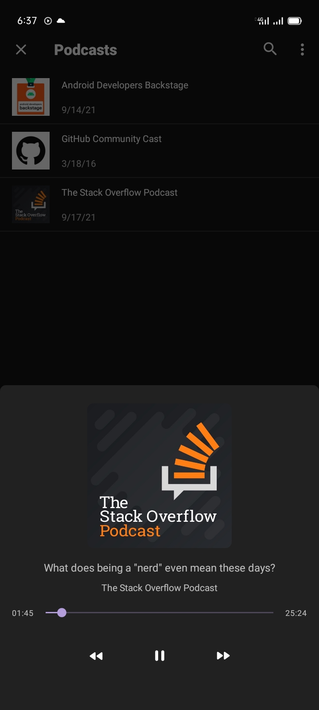
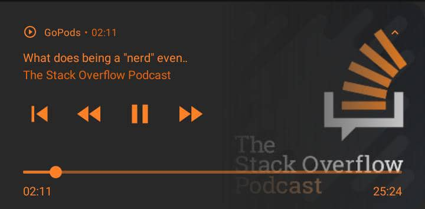
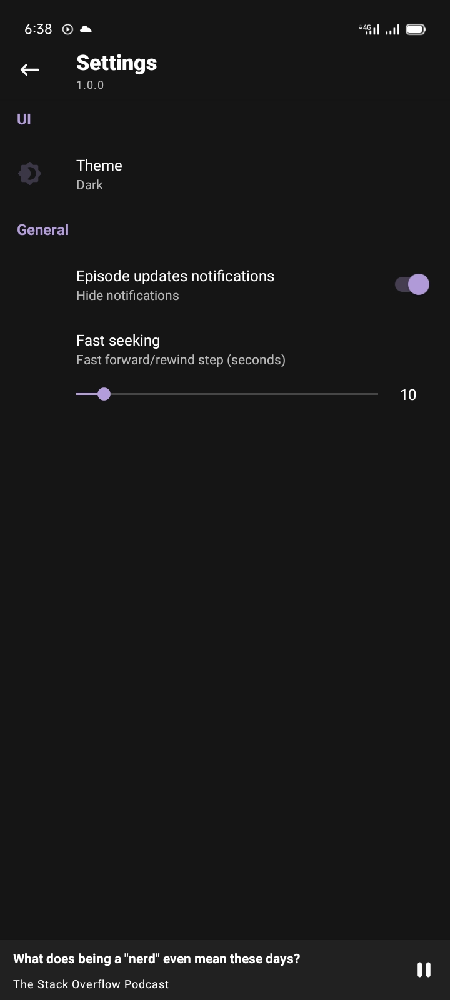

# GoPods 🎙️

GoPods is a simple podcast app built 100% with Kotlin, the application allow live searching and
playing podcasts from the internet.

[](https://play.google.com/store/apps/details?id=com.colisa.podplay)

### Status: 🚧 In progress 🚧

GoPods is still in the active of development. However, most of the app's architecture has been
implemented, as well as the data layer, and early stages of dynamic theming.

### Download

If you want to clone the repo, open a terminal and type a git checkout command:

    git@github.com:mtali/gopods.git

## Screenshots

<p align="center">






</p>

## Features

* Search for podcasts
* Play episodes (audio)
* Subscribe to podcasts
* Offline caching
* e.t.c

## License

```
Copyright 2020 The Android Open Source Project

Licensed under the Apache License, Version 2.0 (the "License");
you may not use this file except in compliance with the License.
You may obtain a copy of the License at

    https://www.apache.org/licenses/LICENSE-2.0

Unless required by applicable law or agreed to in writing, software
distributed under the License is distributed on an "AS IS" BASIS,
WITHOUT WARRANTIES OR CONDITIONS OF ANY KIND, either express or implied.
See the License for the specific language governing permissions and
limitations under the License.
```


