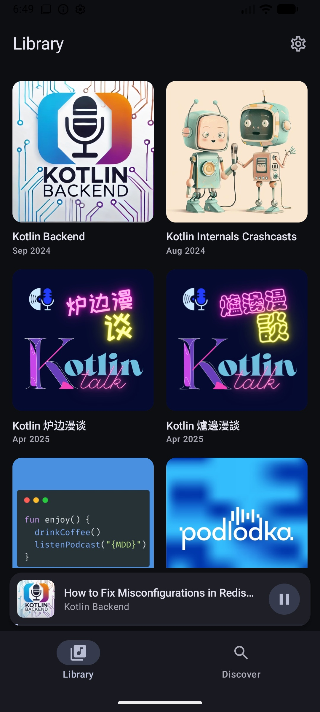
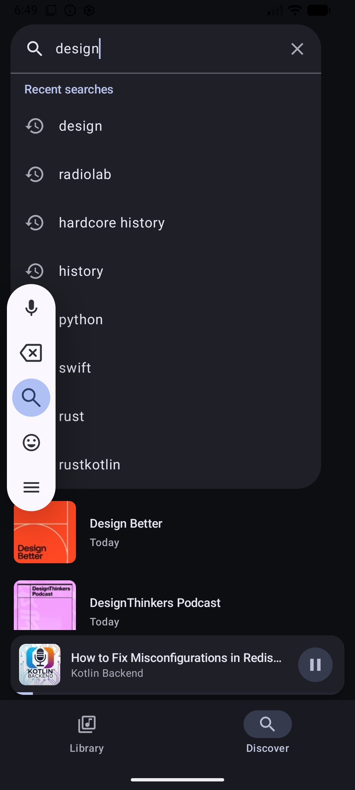
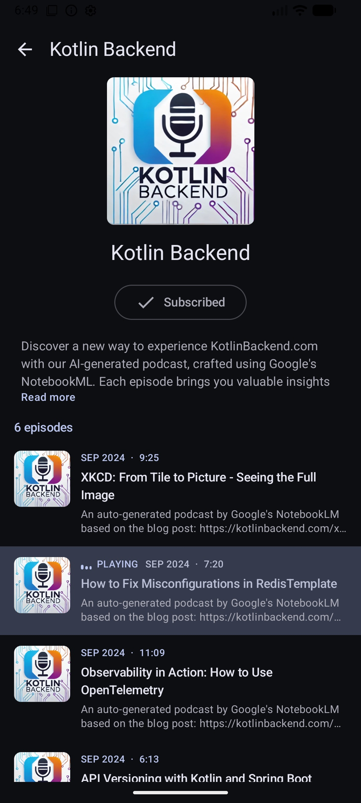
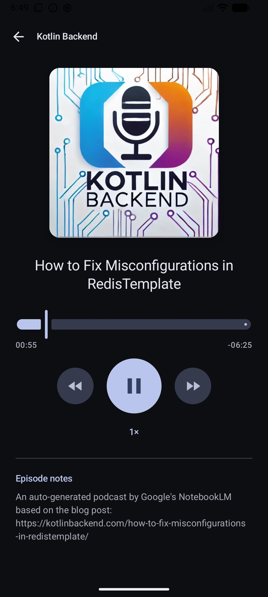
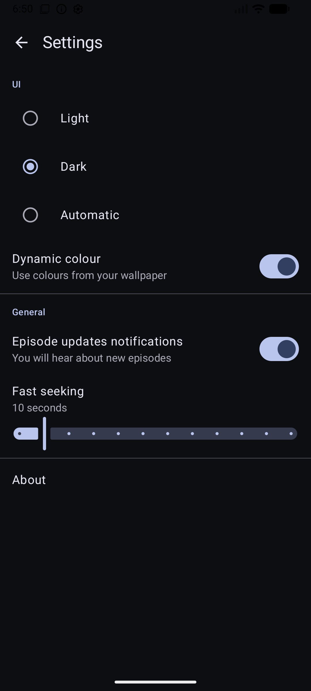
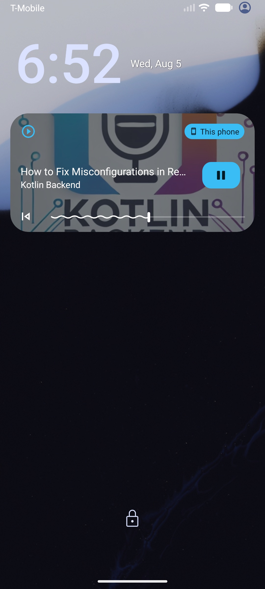

# GoPods 🎙️

GoPods is a podcast app built entirely in Kotlin and Jetpack Compose. Search
iTunes for podcasts, subscribe, and play episodes with background playback and
lock screen controls.

### Download

If you want to clone the repo, open a terminal and type a git checkout command:

    git@github.com:mtali/gopods.git

## Screenshots

<p align="center">
  
  
  
</p>
<p align="center">
  
  
  
</p>

More detail, and how to recapture them, in
[docs/screenshots](docs/screenshots/README.md).

## Features

* Search podcasts from the iTunes catalogue
* Subscribe and keep a library
* Background playback with notification and lock screen controls
* Offline caching of podcasts and episodes, with an offline state that retries on
  reconnect
* Hourly check for new episodes, with a notification
* Material You dynamic colour, light and dark themes
* Adapts to tablets and landscape with a navigation rail

## Tech stack

* **UI** Jetpack Compose, Material 3, Navigation 3
* **Architecture** MVVM, `StateFlow` UI state, unidirectional data flow
* **DI** Hilt
* **Playback** Media3, `MediaSessionService` and `MediaController`
* **Storage** Room, DataStore
* **Networking** Retrofit, OkHttp, kotlinx.serialization, `RssParser`
* **Images** Coil
* **Background work** WorkManager

Single Gradle module, packages arranged as if they were modules:

```
app/         application class, activity, root composable, navigation host
core/        api, common, data, database, datastore, dispatchers, logs,
             models, navigation, player, ui
features/    library, discover, podcast_details, now_playing, settings
sync/        the periodic episode update worker
```

Requires Android 7.0 (API 24) or newer.

## Building

```
./gradlew assembleDebug
```

Release builds are signed from a git ignored `keystore/keystore.properties`; see
`keystore/keystore.properties.template`. Without that file the release build
falls back to the debug key so it still assembles.

```
./gradlew assembleRelease
```

## Migration notes

This app was migrated from Views, DataBinding and Fragments to Compose, and from
ExoPlayer 2 to Media3. See [docs/MIGRATION.md](docs/MIGRATION.md) for what
changed, how database and settings compatibility was preserved, and the bugs
found along the way.

## License

```
Copyright 2020 The Android Open Source Project

Licensed under the Apache License, Version 2.0 (the "License");
you may not use this file except in compliance with the License.
You may obtain a copy of the License at

    https://www.apache.org/licenses/LICENSE-2.0

Unless required by applicable law or agreed to in writing, software
distributed under the License is distributed on an "AS IS" BASIS,
WITHOUT WARRANTIES OR CONDITIONS OF ANY KIND, either express or implied.
See the License for the specific language governing permissions and
limitations under the License.
```
